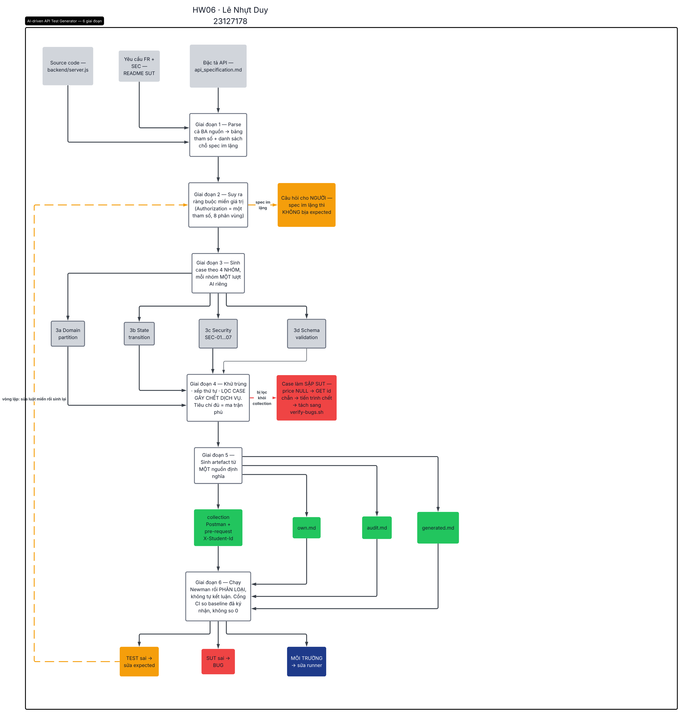

# AI-driven API Test Generator — thiết kế (§7, mức Create G9.5)

- **Sinh viên:** Lê Nhựt Duy — **MSSV:** 23127178
- **Bản hiện thực chạy được:** [`tools/gen-artifacts.mjs`](../tools/gen-artifacts.mjs) +
  [`.claude/skills/api-test-design/SKILL.md`](../.claude/skills/api-test-design/SKILL.md)
- **Đã dùng thật:** toàn bộ **157 test case / 372 assertion** của bài này do generator sinh ra (114 case lượt 1 · 22 lượt 2 · 21 do sinh viên chọn).
- **Sơ đồ:** [`diagram/generator-flow-selfdrawn.png`](diagram/generator-flow-selfdrawn.png) — sinh viên dựng
  trên **Lucidchart**: [tài liệu gốc](https://lucid.app/lucidchart/7eec813a-2306-4d53-8fc0-0649ec4b5c06/view) *(mở `File → Revision history` để xem lịch sử chỉnh)*.
  Xuất xứ ghi chi tiết ở [`diagram/README.md`](diagram/README.md).

## 1. Bài toán

**Vào:** đặc tả API (`api_specification.md`) + tập yêu cầu FR/SEC của SUT + source code.
**Ra:** (a) bảng test case Markdown 12 cột (để xuất Excel §14), (b) collection Postman chạy được bằng
Newman, (c) danh sách **câu hỏi cho người** ở những chỗ đặc tả im lặng.

Phủ đúng 4 nhóm §6.1: domain partition trên **mọi** tham số · state transition · security SEC-01…SEC-07 ·
schema validation.

## 2. Vì sao không phải "một prompt gửi cả spec"

Đề §2 cấm prompt gộp, nhưng lý do kỹ thuật quan trọng hơn lý do quy định. Ba loại test case **không** sinh
ra được từ một lượt đọc đặc tả:

| Loại | Vì sao một prompt không ra được | Bằng chứng từ bài này |
|---|---|---|
| **State transition** | Cần một **chuỗi** request có thứ tự, mỗi bước phụ thuộc kết quả bước trước; một prompt gộp sinh ra các case rời rạc, mỗi case tự đủ | BUG-09 (giỏ không xoá sau checkout) chỉ lộ ra ở chuỗi `add → cart → checkout → cart` |
| **Security có bằng chứng tác động** | Đặc tả **không** nói ai được làm gì; ràng buộc đó nằm ở SEC-01…SEC-07, và phải thêm bước `GET` lại để chứng minh dữ liệu đã đổi | BUG-13 lên Critical chỉ vì có TC-103 đọc lại sản phẩm |
| **Đặc điểm hiện thực** | Không có trong đặc tả — phải đọc source hoặc chạy request thật | BUG-04 (`price.toString()` theo chẵn/lẻ id), BUG-05 (LIKE với Unicode) |

Thêm một lý do thực nghiệm: khi để AI sinh cả bộ trong một lượt, nó **bịa expected** ở chỗ đặc tả im lặng
(3 case, xem `report/main-report.md` §11). Tách bước 1 thành *"rút tham số và **liệt kê chỗ spec im lặng**"*
làm cho những chỗ đó trở thành đầu ra hiển thị, thay vì bị lấp bằng phỏng đoán.

## 3. Kiến trúc — 6 giai đoạn

| # | Giai đoạn | Vào | Ra | Quyết định thiết kế |
|---|---|---|---|---|
| 1 | **Parse spec + 3 nguồn** | `api_specification.md`, FR/SEC, `server.js` | bảng tham số: nơi truyền · kiểu · bắt buộc · ràng buộc · **chỗ im lặng** | Đọc **cả ba** nguồn: expected bám spec, nhưng chỗ spec ≠ code chính là bug |
| 2 | **Suy ra ràng buộc** | bảng tham số | luật miền cho từng tham số | Chỗ spec im lặng → **không bịa**: đánh dấu `OPEN-QUESTION`, chỉ khẳng định phần spec bảo đảm |
| 3 | **Sinh case theo 4 nhóm** | luật miền | case thô, mỗi case có cột `Căn cứ` | **4 lượt riêng**, không gộp. `Authorization` được coi là **một tham số** với 8 phân vùng |
| 4 | **Khử trùng + xếp thứ tự + gán folder** | case thô | case độc lập + chuỗi state có thứ tự | Case mutate state phải đi kèm case verify **ngay sau**. Case có thể làm chết SUT bị **loại khỏi collection** (xem §5) |
| 5 | **Sinh artefact** | case đã chốt | bảng 12 cột × 3 file + collection Postman | **Một nguồn** sinh cả hai — viết tay hai chỗ thì bảng và collection lệch nhau ngay lần sửa đầu |
| 6 | **Vòng lặp tự kiểm** | kết quả Newman | phân loại từng assertion đỏ | **Không** tự kết luận "đã tìm ra bug": chỉ phân loại *SUT sai / test sai / môi trường* rồi đưa cho người |

## 4. Sơ đồ

**Tài liệu Lucidchart gốc:** https://lucid.app/lucidchart/7eec813a-2306-4d53-8fc0-0649ec4b5c06/view — mở `File → Revision history` để thấy từng lần chỉnh.

**Xuất xứ — ghi đúng cách đã làm, không ghi gọn thành "self-drawn":** nội dung sơ đồ là **thiết kế của bài**
(6 giai đoạn ở §3, ba nhánh ở §5), được viết ra thành bản nháp [`diagram/DRAWING-SHEET.md`](diagram/DRAWING-SHEET.md)
— 18 hộp kèm chữ và màu, 13 mũi nối kèm nhãn. **Sinh viên** dựng hình trên **Lucidchart** từ bản nháp đó:
lượt đầu bố cục sai ở 5 chỗ (mất màu, `3d` lạc xuống đáy, hai hộp nhánh nằm sai hàng, hàng phân loại bị xé,
thiếu phụ đề), sinh viên chỉnh từng chỗ rồi export. Bản do AI render trước đó **không nộp** và đổi tên thành
`reference-layout-AI-KHONG-NOP.png`.

**Ba nhánh trong hình là ba quyết định thiết kế, không phải trang trí:**

| Nhánh | Nội dung |
|---|---|
| Giai đoạn 2 → **Câu hỏi cho NGƯỜI** (cam) | chỗ spec im lặng mà không suy được từ FR/SEC thì thành câu hỏi, không thành expected. 3 case đã bị hạ expected qua nhánh này |
| Giai đoạn 4 → **Case làm SẬP SUT** (đỏ) | case gây chết dịch vụ bị lọc khỏi collection, chuyển sang script tái hiện riêng |
| Giai đoạn 6 → **3 hướng phân loại** | mỗi assertion đỏ phải trả lời: SUT sai / test sai / môi trường. 19 bug đi hướng thứ nhất, 3 case hướng thứ hai, 4 assertion hướng thứ ba |

## 5. Hai quyết định thiết kế đáng ghi lại

**a) Tiêu chí "đủ" không phải là số case.** Đề đòi ≥35 case/API, nhưng đếm số dòng là tiêu chí sai: 35 case
bỏ cả nhóm security thì kém 35 case phủ đều. Generator dựng **ma trận phủ** (hàng = tham số, cột = loại
phân vùng) và báo **ô còn trống**. Ô trống nhìn ra được, còn con số "35" thì không.

**b) Generator phải biết case nào có thể giết SUT.** Giai đoạn 4 loại chuỗi `partial update → price NULL →
GET id chẵn` khỏi collection vì nó làm sập backend (**BUG-14**), và chuyển nó sang script tái hiện riêng.
Nếu để trong collection, mọi case phía sau sẽ đỏ **vì môi trường** — bộ test tự phá giá trị chứng minh của
chính nó. Đây là ràng buộc mà không đặc tả nào nói, chỉ phát hiện được sau khi chạy thật.

## 6. Pseudocode

[`pseudocode.py`](pseudocode.py) — mô tả 6 giai đoạn ở dạng thuật toán.
Bản chạy được: [`tools/gen-artifacts.mjs`](../tools/gen-artifacts.mjs) (~230 dòng, 25 loại check).

## 7. Giới hạn đã biết

1. **Không tự suy ra ràng buộc nghiệp vụ không có trong đặc tả.** Ví dụ "giá trong giỏ phải bằng giá
   catalog" là **người** đặt ra từ FR-07/FR-08; generator chỉ mã hoá nó thành assertion.
2. **Không phân biệt được "SUT sai" với "test sai".** Giai đoạn 6 chỉ phân loại và đưa cho người —
   tự động kết luận là cách sinh ra bug giả.
3. **Đầu vào là spec Markdown viết bằng tay**, không phải OpenAPI, nên giai đoạn 1 (parse) hiện làm bằng
   người + AI, chưa tự động hoàn toàn.
4. **Ma trận phủ chỉ đo được phân vùng đã khai báo.** Một phân vùng chưa ai nghĩ ra thì không có ô để
   trống — 22 case §6.3 của bài này là bằng chứng: chúng đến từ đọc source và dữ liệu thật, không từ ma trận.

## 8. Hiện thực dưới dạng Agent Skill

| Skill | Vai trò trong sơ đồ |
|---|---|
| [`api-test-design`](../.claude/skills/api-test-design/SKILL.md) | giai đoạn 1–3 (5 bước, mỗi bước một lượt) |
| [`api-test-audit`](../.claude/skills/api-test-audit/SKILL.md) | giai đoạn 4 + §6.2/§6.3 |
| [`postman-newman`](../.claude/skills/postman-newman/SKILL.md) | giai đoạn 5–6 |
| [`ai-audit-logger`](../.claude/skills/ai-audit-logger/SKILL.md) | ghi §9 sau mỗi lượt |

§7 khuyến khích **video demo** cho thấy skill sinh test case cho một API — điền link YouTube vào `README.md`.
